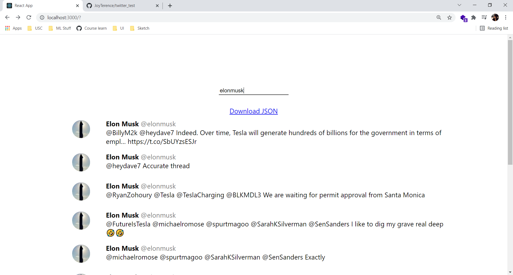

# Web App to fetch 10 recent tweets by a user

## Snapshot of webapp



## Downloaded json

Contains `author, screen_name, text, created_at`

Example:

```json
{
  "0": {
    "author": "Elon Musk",
    "screen_name": "elonmusk",
    "text": "@BillyM2k @heydave7 Indeed. Over time, Tesla will generate hundreds of billions for the government in terms of empl… https://t.co/SbUYzsESJr",
    "created_at": "Tue Nov 16 21:24:40 +0000 2021"
  },
  "1": {
    "author": "Elon Musk",
    "screen_name": "elonmusk",
    "text": "@heydave7 Accurate thread",
    "created_at": "Tue Nov 16 20:47:30 +0000 2021"
  },
  "2": {
    "author": "Elon Musk",
    "screen_name": "elonmusk",
    "text": "@RyanZohoury @Tesla @TeslaCharging @BLKMDL3 We are waiting for permit approval from Santa Monica",
    "created_at": "Tue Nov 16 02:11:13 +0000 2021"
  },
  "3": {
    "author": "Elon Musk",
    "screen_name": "elonmusk",
    "text": "@FutureIsTesla @michaelromose @spurtmagoo @SarahKSilverman @SenSanders I like to dig my grave real deep 🤣🤣",
    "created_at": "Tue Nov 16 00:56:51 +0000 2021"
  },
  "4": {
    "author": "Elon Musk",
    "screen_name": "elonmusk",
    "text": "@michaelromose @spurtmagoo @SarahKSilverman @SenSanders Exactly",
    "created_at": "Tue Nov 16 00:44:50 +0000 2021"
  },
  "5": {
    "author": "Elon Musk",
    "screen_name": "elonmusk",
    "text": "@business Burry is a broken clock",
    "created_at": "Mon Nov 15 22:13:05 +0000 2021"
  },
  "6": {
    "author": "Elon Musk",
    "screen_name": "elonmusk",
    "text": "@wapodavenport The hard work by FAA, US Fish &amp; Wildlife and Texas Parks &amp; Wildlife is much appreciated, as well as… https://t.co/9kLmGtVerE",
    "created_at": "Mon Nov 15 20:01:47 +0000 2021"
  },
  "7": {
    "author": "Elon Musk",
    "screen_name": "elonmusk",
    "text": "@BillyM2k Normal money is actually a bunch of ancient mainframes running cobol in batch mode, where govt can edit m… https://t.co/ZJMvQ35roI",
    "created_at": "Mon Nov 15 18:58:21 +0000 2021"
  },
  "8": {
    "author": "Elon Musk",
    "screen_name": "elonmusk",
    "text": "@Paul49787221 @mooroobee @itsALLrisky @SenSanders Exactly",
    "created_at": "Mon Nov 15 18:13:09 +0000 2021"
  },
  "9": {
    "author": "Elon Musk",
    "screen_name": "elonmusk",
    "text": "@PPathole @teslaownersSV @Kristennetten @itsALLrisky @SenSanders Yes, that is the other major source of dilution. A… https://t.co/NuJ8lZSzQh",
    "created_at": "Mon Nov 15 18:03:00 +0000 2021"
  }
}

```

## Frontend (React based webapp)

## How to Run Frontend?

1. Download/Clone code in 'main' branch.
2. Run `npm i` in terminal
3. Run `npm start` in terminal

## Backend (Fastify server)

This backend is the middleman between frontend and twitter API.
This was introduced as the twitter API doesn't support CORS (react cannot directly talk to twitter API due to this restriction)

## How to Run Backend?

1. Download/Clone code in 'main' branch.
2. [IMPORTANT] There is a `TWITTER_TOKEN` variable in .env file. Replace `<Enter your token here>` with your twitter token
3. Run `npm i` in terminal
4. Run `npm start` in terminal
